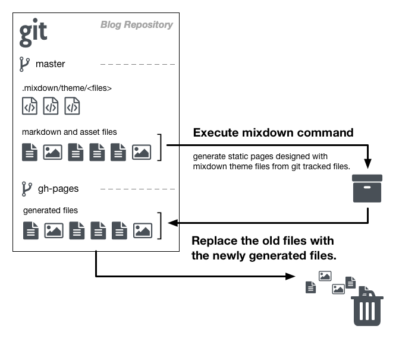

GitHub でブログを書き始めてみたものの、リポジトリにコミットするだけだと味気なさすぎて書く気分にならない。。。
早くブログらしい体裁を作らないとブログを書く事そのものが早々に終了してしまいそうなので、週末の時間の空いた時間ゴソゴソと静的サイトジェネレータを作ってみた。

## 使いやすい静的サイトジェネレータを求めて

言わずもがなだけれど静的サイトジェネレータは英語で表記する Static Site Generator である。簡単に説明すると、特定の形式で書かれた記事を HTML 形式に変換し、それら生成されたページ間のリンクを繋ぎ合わせたり、デザインを当てたりして一つの完成されたウェブサイトを生成するツール。基本的には毎回このように一から作り直すものなので、生成されたページをアップロードして公開できる場所さえあれば良いので、すごくお気軽に使えるツールとなっている。

この静的サイトジェネレータというのは結構昔からあって、パッと思い出すのは [Blosxom](https://ja.wikipedia.org/wiki/Blosxom) が（自分の中では）メジャーどころで最も古い静的サイトジェネレータで、2000年より前からあったような気がする。今では結構な数のツールがあるので詳しく知りたい時は [static-site-generator](https://github.com/topics/static-site-generator) を徘徊してみると良いと思う。

しかし、これだけ人気のツールが色々とあっても、どれを使おうかとざっくりと色々見て回ってみると何だかどれもイマイチしっくりこない。単純に Markdown で記事を書いて、作成時順での並べ替えと内容に書かれたタグによる分類、あとはトップページと一覧ページの作成さえ出来て、それぞれのページの最もシンプルなテンプレートさえあれば良いのだけれど、そんなものはなかったのである。競争のためかどうかはわからないけれど、デフォルトで見栄えを良く機能をてんこ盛りにしてあるので、サクッとお気楽にブログを書きたい人間にはこれらを解読する気力は全く無い。

## ブラウザだけで使える静的サイトジェネレータ

そんなわけで、あーでもないこーでもないとブー垂れながらアレコレ探してても時間の無駄だし、もういっその事作ってしまえ！という事で作り始めたのが２ヶ月くらい前だったりする。やれ仕事だ、やれ引越しだ、やれ通院だ、やれ贈り物を買わなくてはだなんて日々を過ごしていると、集中して作る時間が中々取れなかったりして結構時間がかかってしまった。

とりあえず、コンセプトとしては全てブラウザだけで完結するツールにしたいけれど、そのためには CI サービス上でツールを実行しなくてならない。開発言語選定として、環境の依存性が低く、ビルドが速く、メモリをあまり消費せず、静的サイトジェネレータを開発するための機能がある程度揃っている、かつ、使い慣れた言語が良いだろうという事で Go を選択した。

まず、記事の管理は「[GitHub でブログを始める](started-a-blogging-on-github.md)」でも書いたように、GitHub を利用して git リポジトリで管理するのが前提となる。そして、このリポジトリの `master` ブランチを元にして開発した静的サイトジェネレータ「[mixdown](https://github.com/mah0x211/mixdown)」を使って静的ページを生成し、`gh-pages` ブランチへ生成されたファイルをコミットするというワークフローになる。

1. git リポジトリ内で `master` ブランチへ切り替える
2. mixdown コマンドを実行し、任意のディレクトリにファイルを出力する
3. `gh-pages` ブランチへ切り替える
4. 管理されているファイルを全て削除
5. 出力済みのファイルをリポジトリ内に移してコミットする
6. `git push` で `gh-pages` ブランチの変更を GitHub 上へ反映させる

ざっくり言うとこんな感じか。

そして、このワークフローを自動化するために [CircleCI](https://circleci.com) を利用し、`master` ブランチに変更があった際にこのワークフローが自動的に実行されるよう設定する事で晴れて「ブラウザだけで使える静的サイトジェネレータ」としての体裁が整った。気がする。まぁ、実際には CircleCI で公開鍵を設定する時にローカルマシン上で `ssh-keygen` コマンドを使う必要があるので、完全にブラウザだけで使い始めることが出来ないのが残念なとこでもある。

ひと通り目的は達したので、しばらくはこれでブログを書いてみることにする。
